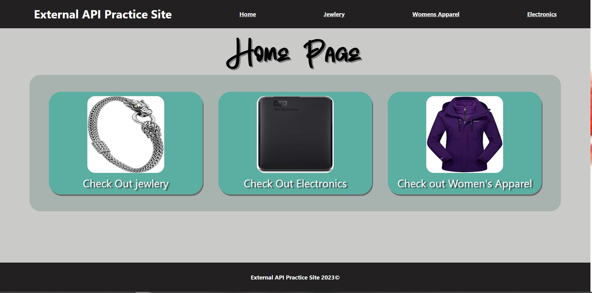

# API Fake Store

The API Fake Store App is a simple web application that allows users to browse, and view details of various products . This project is built using React, Bootstrap and the dummyJSON API as well as the Fake Store API. It demonstrates basic functionalities such as displaying a list of items, and navigating between different pages both with and without Params.



## Table of Contents

- [Installation](#installation)
- [Configuration](#configuration)
- [Usage](#usage)
- [Technologies](#technologies)
- [Pages](#pages)
- [Components](#components)
- [Functionality](#functionality)
- [Contributing](#contributing)
- [Credits/Acknowledgements](#creditsacknowledgements)
- [License](#license)

## Installation

1. Clone the repository:
   ```sh
   git clone [https://github.com/jennihunt/fake-API-store.git]
   ```
2. Navigate to the project directory:
   ```sh
   cd API-Fake-Store
   ```
3. Install the dependencies:
   ```sh
    npm install
   ```

## Usage

1. Start the development server:
   ```sh
   npm start
   ```
2. Open [http://localhost:8080](http://localhost:8080) to view it in the browser.

## Configuration
- This project uses the dummyJSON API and Fake Store API. No API key is required.

## Technologies
- JavaScript
- React.js
- CSS
- HTML
- Bootstrap
- Font Awesome
- DummyJSON API
- Fake Store API

## Pages

### Home Page

The Home Page displays 3 links to navigate to specific categories of products. Each product is represented by a link that shows the product name, image, and a short description. Users can click on a product card to view its details.

### Product Page

The Product Page shows information about a selected category. It displays the product name, image, and price. Users can navigate to the details page to view more details on the product by clicking on the click for more info button.

### Deatils Page

The Details Page displays more info on each product. This page also offers a buy button, once clicked the page will display that the item was added to the cart or once clicked again the message is removed.

## Components

### Header

The Header component is a reusable h1 tag that will be displayed at the top of each page to allow user to know what page they are currently on. This allows for the page to be formatted to be visually cohesive.

### Footer

The Footer includes the name of the project and date created to be viewed on each page .


## Functionality

- Display visual links to the product pages on the Home Page.
- Click on a product image to view all products for that category on the Product Page.
- click view Details to view more info on the product and have the ability to add item to cart (not currently attached to cart).

## Contributing

Contributions are welcome! Please feel free to submit a pull request if you would like to add new features, fix bugs, or improve the project.

## Credits/Acknowledgements

I would like to extend my gratitude to the contributors, mentors, and the open-source community for their support and resources throughout the development of this project:

- **Open Source Community:** Thank you for the invaluable tools, libraries, and documentation that made this project possible.
- **Mentors and Peers:** Special thanks to those who provided feedback, ideas, and encouragement during the development process.
- **Content Creators and Educators:** Appreciation for the tutorials, blog posts, and videos that guided the implementation of various features.

## License

This project is licensed under the MIT License - see the [LICENSE](LICENSE) file for details.
